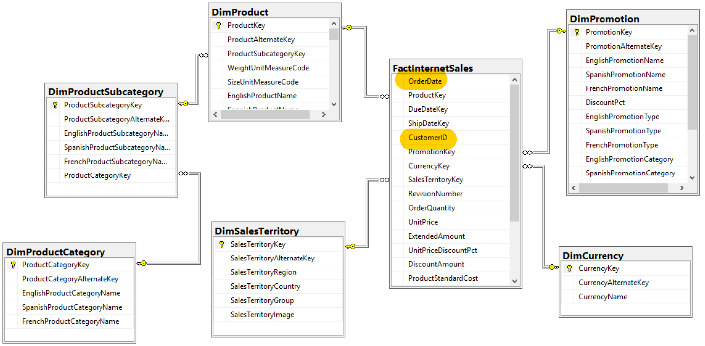
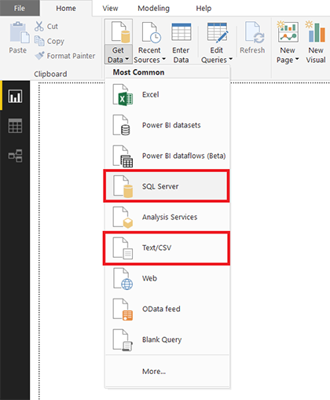
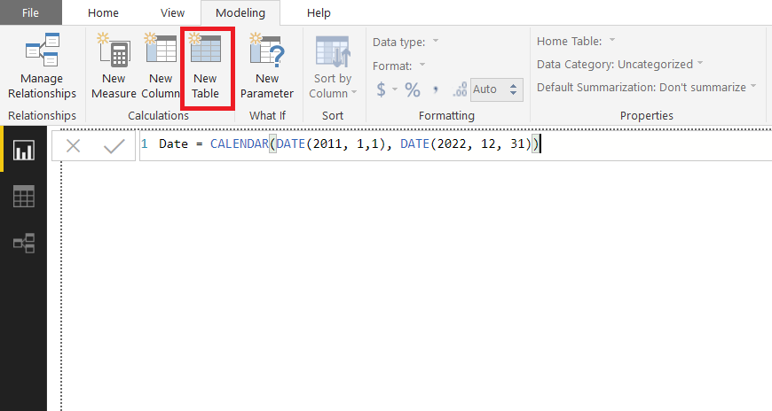
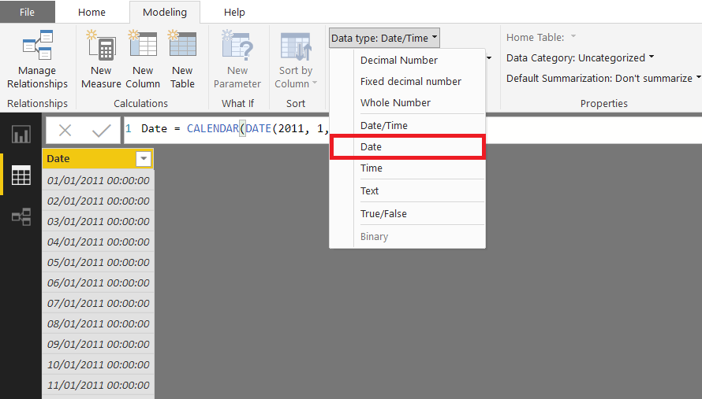
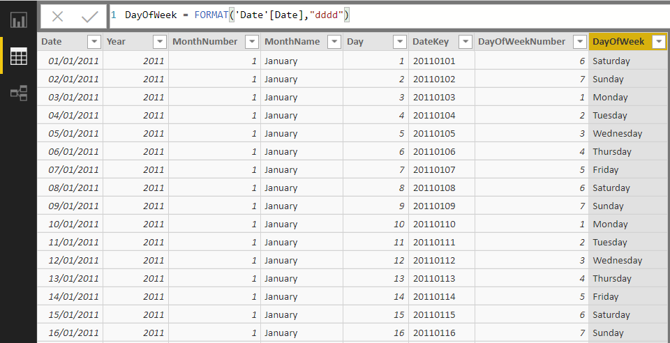
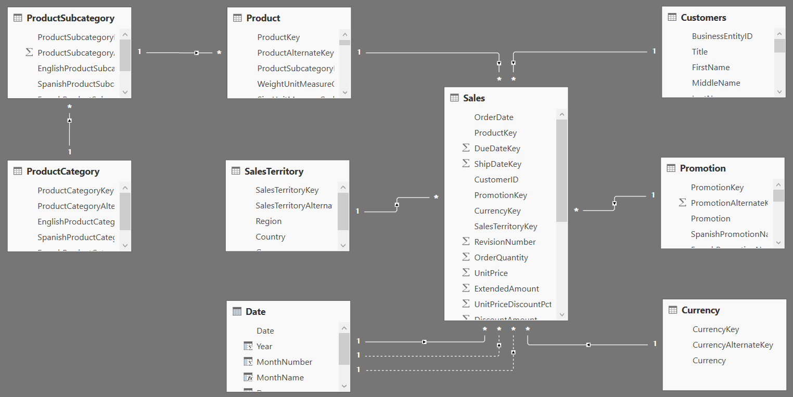
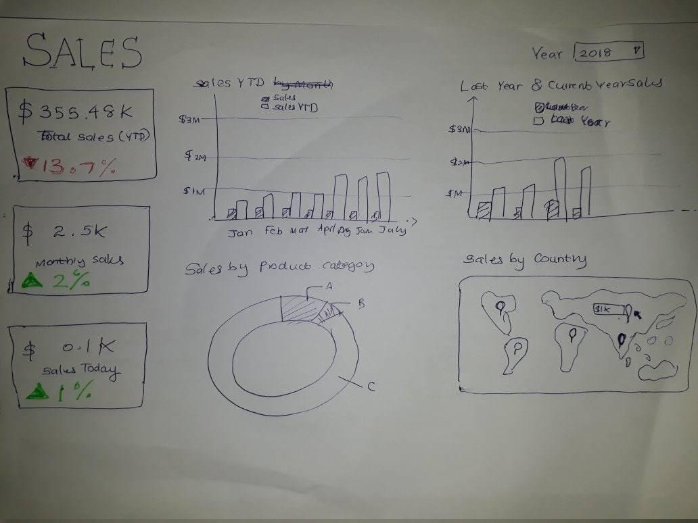
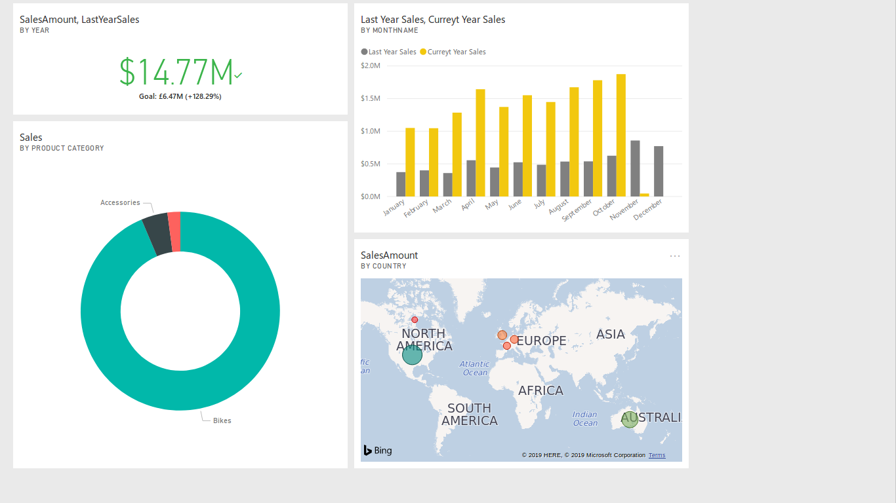
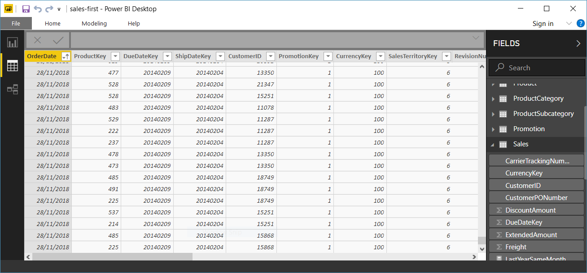

# Sales First - Self-Service Business Intelligence

Step by step Self-Service BI implementation using Microsoft Power BI.

This work is done as an assignment under the course **Business Intelligence and Decision Support Systems - SENG 42673** of **BSc in Software Engineering, University of Kelaniya**.

Facilitator: [Mr. Dinesh Priyankara](https://lk.linkedin.com/in/dineshpriyankara).

Presentation : [Click here](https://www.slideshare.net/JayathmaChathurangan/sales-first-bi-solution1).

## 1. Introduction

We work for a company named **SalesFirst (Pvt)** Ltd. The IT department has developed a relational data warehouse addressing business intelligence requirement related to the company. The logical ER
diagram related to the data warehouse designed is shown below



IT department has implemented an ETL solution for loading data into the data warehouse. **ETL solution is scheduled to execute every day** during off-peak hours. Customer information is NOT maintained in the data warehouse. However, it is available as a text file.

1. Data Warehouse - SQL Server ([backup_file](resource-files/SalesFirst.bak))
2. Customer Dimension in a Flat CSV file ([csv_vile](resource-files/Customers.csv)) - For demonstrating inclusion of external resources.

## 2. Requirement

We need to design a **reporting** and **dashboard** solution, addressing business requirements. Our BA has gathered required details for the solution. The following points shows requirements related to the reporting and dashboard solution

### **Sales department** needs a report (or multiple reports) that shows following items

1. Sales Amount **by month** for the current year or selected year.
1. Sales Amount **by Product Category** for the current year or selected year. Should be able to easily view Sales of **Sub Categories** for a **specific Category** and Sales of Products for a **specific Sub Category**.
1. **YTD Sales Amount** by month for the current year or selected year. Prefer to see YTD Sales **along with monthly Sales** and should be able to see the **trend** clearly.
1. **Comparison** between Sales Amount for last year and current year (or selected year) for each month.
1. Sales Amount **by Country**. Should be able to immediately and clearly see countries with **higher sales** and countries with **lower sales**.
1. Sales Amount for the current month and year (or selected month and year).
1. **Last-Year-Same-Month** Sales Amount for the current month and year (or selected month and year).
1. Sales Amount **by customer location** for the **month**, should be able to see the locations of customer clearly.
1. Sales Amount, Total Product Cost and Tax Amount **by Date**, Category and Currency, for the current month and year (or selected month and year). Should be able to see **highest** and **lower** values of all added easily.

### **Top manage** needs a dashboard (or multiple dashboards) that shows

1. **YTD** Sales Amount for the **current** year.
1. Monthly Sales Amount along with Last Year Same Month Sales Amount, by month for the current year.
1. Sales Amount by country for the current year.

### In addition to the reports and dashboards required, following should be supported

1. Self-Service business intelligence: Business users should be able to create their own reports using a predefined model.
1. Easy to use reporting platform.
1. Collaboration among business users.

## 3. Load Data

Restore the Data Warehouse ([backup_file](resource-files/SalesFirst.bak)) to SQL Server and load it in Power BI Desktop and load Customer CSV file ([csv_vile](resource-files/Customers.csv)).


## 4. Add Date Dimension

Create new table called ***Date***.

```dax
Date = CALENDAR(DATE(2011, 1,1), DATE(2022, 12, 31))
```





Following are the DAX expressions to create other fields.
```dax
Year = FORMAT('Date'[Date], "yyyy")
MonthNumber = FORMAT('Date'[Date], "m")
MonthName = FORMAT('Date'[Date], "mmmm")
Day = FORMAT('Date'[Date], "d")
DateKey = FORMAT('Date'[Date], "yyyymmdd")
DayOfWeekNumber = WEEKDAY('Date'[Date], 2)
DayOfWeek = FORMAT('Date'[Date],"dddd")
```



## 5. Add Customers and Date Dimensions



## 6. Proposed Reports

### Dashboard



**Visual types used and the reason**.
- ***Cards with KPI***      	- YTD sales for the current year (Since it is the Key for strategic level decisions)
- ***Clustured Column Chart*** 	- Sales amount along with last year sales amount by month (Categorical data and comparison make easier)
- ***Basic Map***               - Sales amount by country (Quantitative nature and spatial location)

## 7. Implement Reports

### Dashboard



## 8. Simulate ETL

> IT department has implemented an ETL solution for loading data into the data warehouse. ETL solution is scheduled to execute every day during off-peak hours.

For the demonstration lets add some sales values of for ***December 2018***.


Let's add same sales values from ***December 2016*** to ***December 2018***. Execute the following.

```sql
SELECT *
INTO dbo.sales_temp
FROM dbo.FactInternetSales
WHERE YEAR(OrderDate) = 2016 and MONTH(OrderDate) = 12

UPDATE dbo.sales_temp
SET orderdate = DATEADD(YY, +2, orderdate)

INSERT INTO dbo.FactInternetSales
SELECT * FROM dbo.sales_temp
```

Now execute the following to check the insertion.

```sql
SELECT TOP (10) *
FROM [SalesFirstDW].[dbo].[FactInternetSales]
ORDER BY OrderDate DESC
```

Results.


The model can be refreshed easily with a single click and continue getting business insight.


You can reset this with executing following SQL script and refresh from Power BI again.

```sql
DELETE
FROM dbo.FactInternetSales
WHERE YEAR(OrderDate) = 2018 and MONTH(OrderDate) = 12

DROP TABLE dbo.sales_temp
```